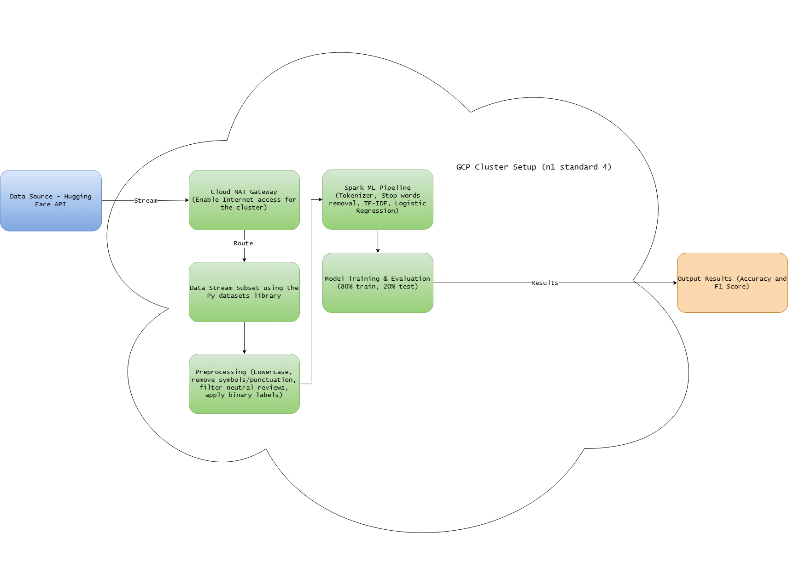

# Sentiment Analysis of Amazon Grocery & Gourmet Food Reviews
### Distributed Machine Learning with Apache Spark on Google Cloud Platform


---

## Academic Context

> **Course:** CAP 4786 – Topics in Big Data
> **Institution:** Florida Polytechnic University
> **Semester:** Spring 2026
> **Type:** Final Group Project
> **Authors:** Jaydon Debus & Philipp Kouterguine

---

## Overview

This project applies distributed machine learning to perform binary sentiment analysis on over 14.3 million Amazon Grocery & Gourmet Food reviews. Using Apache Spark's MLlib on a Google Cloud Platform (GCP) Dataproc cluster, reviews are classified as **Positive** (4–5 stars) or **Negative** (1–2 stars) using a TF-IDF + Logistic Regression pipeline.

A Naïve Bayes baseline model was also implemented under identical conditions to validate the choice of Logistic Regression. Scalability was tested across three dataset sizes (50k, 100k, and 250k records), demonstrating consistent accuracy improvements as training data increases.

---

## Repository Structure

```
big-data-project/
│
|
├── Diagrams/
│   ├── architecture_diagram.png       # System architecture diagram
│   └── architecture_diagram.drawio    # Editable diagram source file
│
├── Notebook/
│   └── sentiment_analysis.ipynb       # Main PySpark notebook
|
├── Presentations /
│   └── Final Presentation.pptx        # In-class Presentation
|
├── report/
│   └── Final Report.docx              # Full technical report
│
├── Results/
|   └── (output screenshots)           # Model output and evaluation results
|
├── README.md
```

---

## Tech Stack

| Component | Technology |
|---|---|
| Distributed Processing | Apache Spark 3.5.3 (PySpark) |
| ML Library | Spark MLlib |
| Cloud Infrastructure | GCP Dataproc (n1-standard-4, 15GB RAM) |
| Data Source | Hugging Face Datasets API |
| Language | Python 3.11 |
| Dataset | Amazon Reviews 2023 — Grocery & Gourmet Food |

---

## System Architecture



- Data streamed directly from Hugging Face API — no full dataset download required
- Cloud NAT Gateway enables secure cluster internet access
- Reviews subsetted, preprocessed, and passed through the Spark ML Pipeline
- Results output as Accuracy and F1-Score

---

## Results

### Logistic Regression (Primary Model)

| Dataset Size | Reviews Trained On | Training Time | Accuracy | F1-Score |
|---|---|---|---|---|
| 50,000 | 46,057 | 18.71s | 91.43% | 90.78% |
| 100,000 | 92,381 | 17.00s | 92.07% | 91.29% |
| 250,000 | 231,821 | 31.54s | **92.82%** | **92.04%** |

### Naïve Bayes (Baseline Model)

| Dataset Size | Reviews Trained On | Training Time | Accuracy | F1-Score |
|---|---|---|---|---|
| 50,000 | 46,057 | 10.05s | 87.90% | 88.72% |
| 100,000 | 92,381 | 14.69s | 87.93% | 88.94% |
| 250,000 | 231,821 | 31.81s | 89.24% | 90.07% |

### Model Comparison at 250,000 Records

| Model | Accuracy | F1-Score |
|---|---|---|
| Logistic Regression | **92.82%** | **92.04%** |
| Naïve Bayes | 89.24% | 90.07% |

Logistic Regression outperforms Naïve Bayes by **+3.58% accuracy** at the largest dataset size, while both models reach comparable training times at scale.

---

## Key Findings

- **More data = better models.** Accuracy improved consistently from 91.43% to 92.82% as dataset size increased from 50k to 250k records.
- **JVM warm-up effect.** The 100k run completed faster than the 50k run (17.00s vs 18.71s) due to Spark's JVM initialization overhead on the first execution — a well-documented behavior, not a scalability anomaly.
- **Class imbalance.** ~87–88% of reviews are positive across all dataset sizes. Despite this, the model correctly classified the vast majority of reviews in manual testing.
- **Single-node ceiling.** The 500,000 record run caused the cluster to crash due to memory exhaustion, demonstrating the real-world need for multi-node distributed infrastructure at full scale.
- **Logistic Regression vs. Naïve Bayes.** Naïve Bayes was faster at smaller sizes but the speed advantage disappeared at 250k records, while Logistic Regression consistently delivered higher accuracy.

---

## How to Run

### Prerequisites
- A Google Cloud Platform account with Dataproc enabled
- A GCP Dataproc cluster (single-node is sufficient for up to 250k records)
- A Cloud NAT gateway configured for outbound internet access
- Python 3.11 with PySpark kernel available on the cluster

### Steps

1. **Clone the repository** and upload `notebook/sentiment_analysis.ipynb` to your GCP Dataproc cluster or Jupyter environment.

2. **Install dependencies** by running the first cell of the notebook:
   ```bash
   pip install "datasets==2.19.0"
   ```

3. **Configure subset size** in Section 3 of the notebook:
   ```python
   subset_size = 50000  # Recommended starting point
   # Other options: 100000, 250000
   ```
   Start with 50,000 to confirm the pipeline works, then increase.

4. **Run all cells sequentially.** The notebook will:
   - Stream data from the Hugging Face API
   - Preprocess and label reviews
   - Train and evaluate the Logistic Regression model
   - Train and evaluate the Naïve Bayes baseline
   - Launch an interactive sentiment prediction demo

5. **Interactive demo** — Section 9 prompts you to enter any product review text and returns a real-time Positive/Negative classification with a confidence score.

### Notes
- A Cloud NAT gateway is required on your GCP cluster for outbound internet access to the Hugging Face API.
- Single-node clusters with 15GB RAM can handle up to ~250,000 records. Beyond that, a multi-node cluster or additional memory is recommended.
- The notebook uses a fixed random seed (`seed=42`) for reproducibility.

---

## Dataset

**Amazon Reviews 2023** — Grocery and Gourmet Food category
Source: [McAuley Lab via Hugging Face](https://huggingface.co/datasets/McAuley-Lab/Amazon-Reviews-2023)
Total reviews: 14.3 million
Access method: Streaming via Hugging Face Datasets API (no full download required)

---

## References

- Aravindan, T. R., Vigneshwar, C. N., & Suganeshwari, G. (2023). Sentiment classification for Amazon fine foods reviews using PySpark. In *Recent developments in electronics and communication systems* (pp. 431–436). IOS Press. https://doi.org/10.3233/ATDE221293
- Bao, Y. (2024). A comparative study of e-commerce review sentiment analysis models based on VADER and RoBERTa. *Journal of Computing and Electronic Information Management, 15*(3), 115–119. https://drpress.org/ojs/index.php/jceim/article/view/28558
- Aqlan, A. A. Q. (2022). Data mining and revealing hidden sentiment in tweets using Spark. *International Journal on Data Science and Technology, 8*(1), 14–21. https://doi.org/10.11648/j.ijdst.20220801.13
- Olalekan, S. U. (2025, August 18). *Leveraging sentiment analysis for predicting Amazon product ratings*. ResearchGate. https://www.researchgate.net/publication/394535525_Leveraging_Sentiment_Analysis_for_Predicting_Amazon_Product_Ratings
